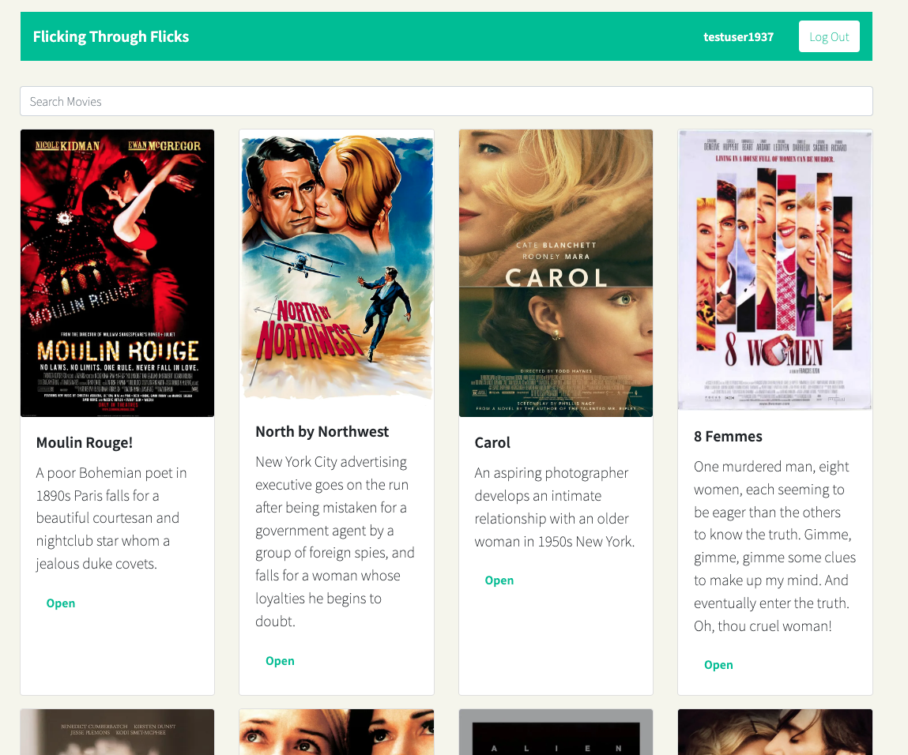
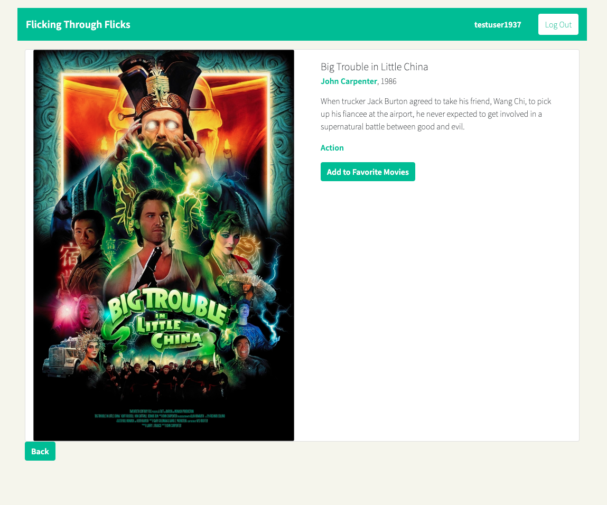
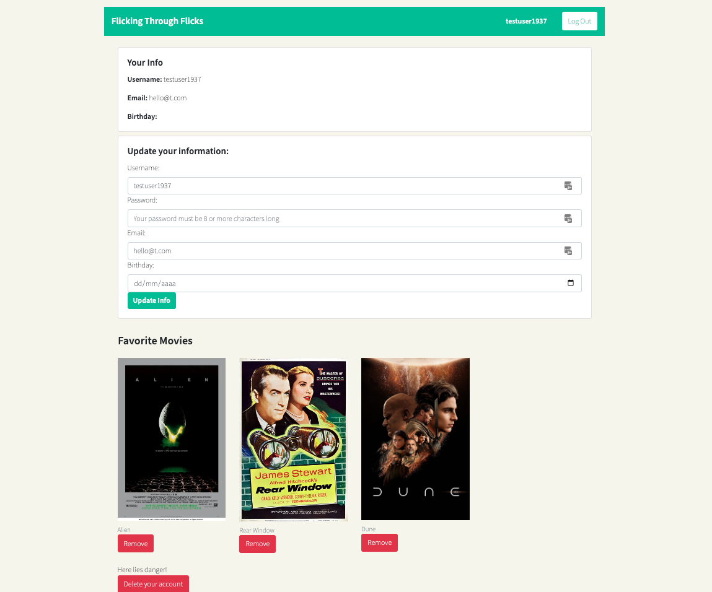

# Project Description
Flicking through Flicks is a client-side application, created with React.js and Sass based on the existing server-side code (REST API and mongo database) from a previous task.
This was my first attempt at a React app and at building a more complex web application.

## Key Features
* User can create a profile
* User can login
* User can edit their user information
* User can curate a list of their favourite movies from the database
* User can access details about the movies
* User can access details about the directors
* User can access details about genres

## Technologies Used
Nodejs, React, React-DOM, Parcel, Axios, Redux, Bootstrap

## Dependencies
* Parcel 2.0.0-nightly.1013
* Database hosted in MongoDB
* [MovieAPI](https://github.com/mareeanamaro/movieAPI) hosted at heroku

## Links
* **Repository:** https://github.com/mareeanamaro/myFlix-client
* **Live link:** WIP
## Screenshots

## How to Use
Clone or download repository

`git clone https://github.com/mareeanamaro/myFlix-client.git`

Run parcel to build

`parcel src/index.html`

